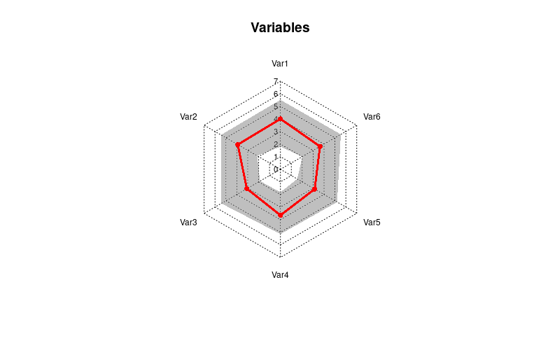

# BIH Charité - Christiane Wetzel

This repository contains an R package developed by _Annie Pham_, a Student Assistant of _Christiane Wetzel_. The package provides various R functions for data analysis and visualization.


## Installation
```
install.packages("devtools")
library(devtools)
devtools::install_github("anniepham7/wetzel")
```

## Usage

### 1. radarBoxplot - wradarBoxplot
The radar-boxplot function presented here is a modification of the *radarchart* function from the library `fsmb`. This modification introduces the concept of the radar-boxplot, which combines elements of both radar charts and boxplots into a single visualization. The original *radarchart* function provided by the `fsmb` library is a useful tool for creating radar charts. However, to enhance its capabilities and enable the visualization of distributional characteristics, this function has been modified to incorporate boxplot elements. By merging the radar chart and boxplot concepts, the radar-boxplot function allows for the simultaneous display of multiple variables while providing insights into their distributions. This modified function provides a more comprehensive understanding of the data by representing the median and quartilers of each variable in a radar-like structure
```
wradarBoxplot <- function(df, axistype = 0, seg = 4, pty = 16, pcol = 1:8, plty = 1:6,
                plwd = 1, pdensity = 0.01, pangle = 45, pfcol = NA, cglty = 3,
                cglwd = 1, cglcol = "darkgrey", axislabcol = "black", title = "",
                maxmin = TRUE, na.itp = TRUE, centerzero = FALSE, vlabels = NULL,
                vlcex = NULL, caxislabels = NULL, calcex = NULL, paxislabels = NULL,
                palcex = NULL, ...)
```
Arguments:
- df: A data frame containing the variables to be plotted. The number of variables must be 3 or more.
- axistype: An integer specifying the type of axis labels to be displayed. Default is 0.
- seg: An integer specifying the number of segments in the radar plot. Default is 4.
- pty: An integer or vector specifying the point types for plotting the data points. Default is 16.
- pcol: An integer or vector specifying the colors for the data points. Default is 1:8.
- plty: An integer or vector specifying the line types for connecting the data points. Default is 1:6.
- plwd: A numeric or vector specifying the line widths for connecting the data points. Default is 1.
- pdensity: A numeric or vector specifying the density of shading for the area between the lower and upper quartiles. Default is 0.01.
- pangle: A numeric or vector specifying the angle at which the shading lines are drawn. Default is 45.
- pfcol: A numeric or vector specifying the colors for the shading between the lower and upper quartiles. Default is NA.
- cglty: An integer specifying the line type for the concentric grid lines. Default is 3.
- cglwd: A numeric specifying the line width for the concentric grid lines. Default is 1.
- cglcol: A character specifying the color for the concentric grid lines. Default is "darkgrey".
- axislabcol: A character specifying the color for the axis labels. Default is "black".
- title: A character specifying the title for the radar plot. Default is an empty string.
- maxmin: A logical value indicating whether the maximum and minimum values should be plotted. Default is TRUE.
- na.itp: A logical value indicating whether missing values should be interpolated. Default is TRUE.
- centerzero: A logical value indicating whether the radar plot should be centered at zero. Default is FALSE.
- vlabels: A character vector specifying the labels for the variables. Default is NULL.
- vlcex: A numeric specifying the character expansion for the variable labels. Default is NULL.
- caxislabels: A character vector specifying the labels for the concentric grid lines. Default is NULL.
- calcex: A numeric specifying the character expansion for the concentric grid line labels. Default is NULL.
- paxislabels: A character vector specifying the labels for the variable axes. Default is NULL.
- palcex: A numeric specifying the character expansion for the variable axis labels. Default is NULL.
- ...: Additional arguments to be passed to the plot function.

Note: This is a modified version of the original `radarBoxplot` function, so the behavior may differ slightly from the original.
```
library(wetzel)

#Example
dataset <- data.frame(
  Var1 = runif(100, 0, 7),
  Var2 = runif(100, 0, 7),
  Var3 = runif(100, 0, 7),
  Var4 = runif(100, 0, 7),
  Var5 = runif(100, 0, 7),
  Var6 = runif(100, 0, 7)
)

max_min <- data.frame(
  Var1 = c(7, 0), Var2 = c(7, 0), Var3 = c(7, 0),
  Var4 = c(7,0), Var5 = c(7, 0), Var6 = c(7,0)
)

rownames(max_min) <- c("Max", "Min")
df <- rbind(max_min, dataset)
wradarBoxplot(df, seg = 7, axistype = 2, title = "Variables", centerzero =TRUE, vlabels = c("Var1", "Var2", "Var3","Var4","Var5","Var6"), cglcol = "black", maxmin = TRUE, pdensity = 0.006, calcex = 0.7, vlcex = 0.75)
```
 
## Contact
For any questions or inquiries, please contact Annie Pham at *annie.pham@charite.de*
